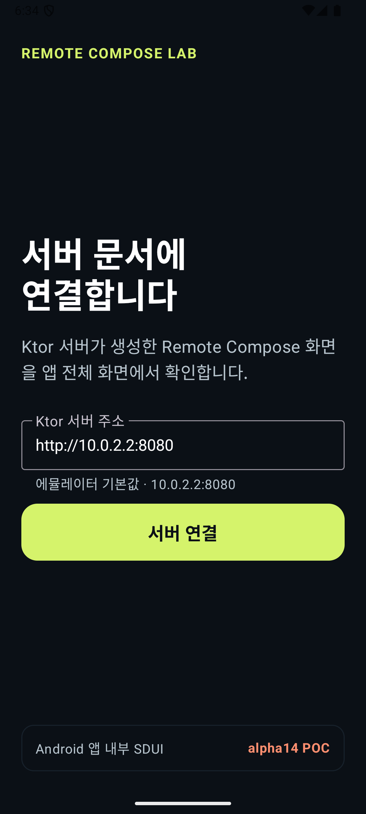
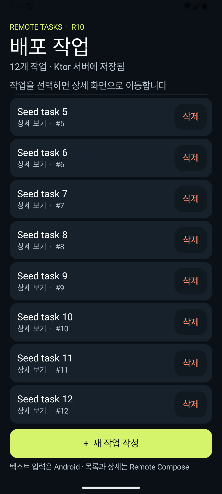
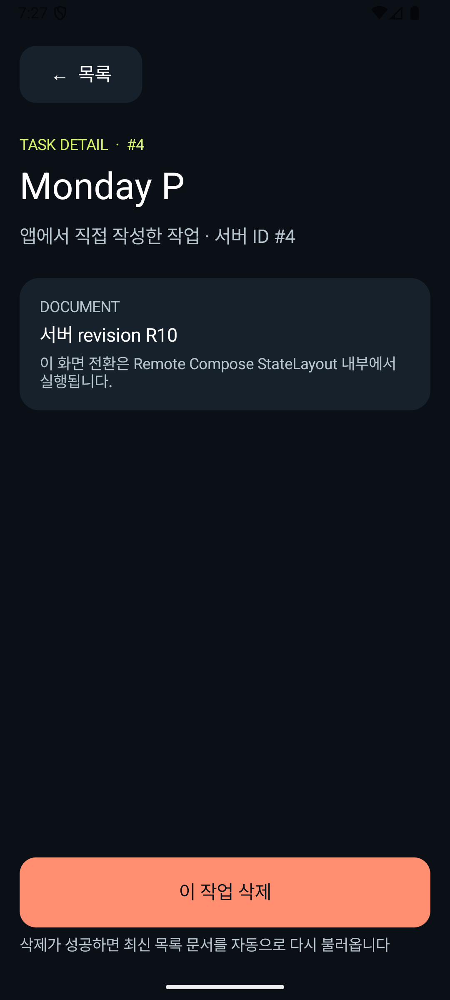

# Remote Compose Research & POC

AndroidX Remote Compose를 **Ktor/JVM document producer → Android embedded player** 구조로 조사하고 실제 기기에서 검증한 저장소입니다.

[](https://developer.android.com/jetpack/androidx/releases/compose-remote)
[](https://kez-lab.github.io/Remote-Compose/)
[](https://github.com/kez-lab/Remote-Compose/actions/workflows/pages.yml)

> 이 저장소는 Google 공식 Codelab이나 production-ready SDK가 아닙니다. `1.0.0-alpha14`의 procedural JVM builder와 embedded player는 고정 source 기준 `LIBRARY_GROUP` restricted API입니다.

## Interactive Codelab

**[GitHub Pages에서 Remote Compose 서버 SDUI 코드랩 열기](https://kez-lab.github.io/Remote-Compose/)**

코드랩은 한 가지 실행 경로만 따라갑니다.

```text
Ktor/JVM data
  → RcScope document operations
  → Remote Compose ByteArray
  → HTTP
  → Android RemoteDocumentPlayer
  → 화면
```

`RemoteText`, `.rs/.rb`, Android Compose capture frontend는 다른 제작·배포 모델이므로 마지막 심화 과정으로 분리했습니다.

## POC Screenshots

<p align="center">
  
  
  
</p>

<p align="center">
  <sub>Native 서버 연결 · Remote Compose 스크롤 목록 · document-local 상세 화면</sub>
</p>

검증된 사용자 흐름:

- 네이티브 Jetpack Compose 서버 연결 화면
- Ktor 서버가 현재 데이터로 생성한 Remote Compose binary document 렌더링
- API로 추가되는 가변 task와 스크롤 목록
- `StateLayout`을 이용한 문서 내부 목록·상세 전환
- native `TextField` 입력과 allowlist 기반 host action
- create/delete 성공 후 최신 document 자동 reload

## 실행

서버는 Android 프로젝트와 독립적으로 빌드할 수 있습니다.

```bash
cd samples/remote-state-lab/server
./gradlew run
```

Android 앱 빌드:

```bash
cd samples/remote-state-lab
./gradlew :app:assembleDebug
```

Android Emulator에서는 서버 주소로 `http://10.0.2.2:8080`을 사용합니다.

## 문서 지도

- [Ktor와 RcScope 서버 중심 SDUI 학습 경로](reference/wiki/ktor-rcscope-codelab-path.md)
- [Remote Compose POC 회고와 도입 판단](reference/wiki/remote-compose-poc-retrospective.md)
- [AndroidX Remote Compose API와 공개 범위](reference/wiki/androidx-remote-compose.md)
- [Document Anatomy와 State Lifecycle](reference/wiki/document-anatomy-and-state.md)
- [alpha14 디버깅과 컴포넌트 이슈](reference/wiki/alpha14-debugging-and-component-issues.md)
- [2026-07-13 문서 전문 감사](reference/wiki/documentation-audit.md)
- [전체 Wiki index](reference/wiki/index.md)

## 검증

```bash
python3 scripts/audit_docs.py
cd samples/remote-state-lab
./gradlew :docs-api-fixture:compileDebugKotlin :app:testDebugUnitTest :app:assembleDebug
cd server
./gradlew test build
```

`docs-api-fixture`는 Wiki의 public Compose creation 예제를 실제 `remote-creation-compose:1.0.0-alpha14`로 컴파일합니다. 문서 감사 스크립트는 링크, Wiki index, 코드랩 단계, 중복 ID와 알려진 API 경계 회귀를 검사합니다.

현재 결론은 **기술 검증에는 유효하지만 production 도입은 보류**입니다. public embedded player, wire 호환성, malformed document 방어, 접근성, font scale, rollback을 추가로 검증해야 합니다.
