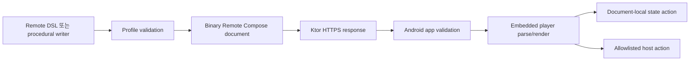

# AndroidX Remote Compose

## 정의와 연구 범위

Remote Compose는 layout, draw operation, expression, animation, state, action을 binary document로 기록하고 player가 평가하는 AndroidX 프레임워크다.

이 저장소는 다음 한 경로만 연구한다.

```text
Ktor/JVM producer -> binary document -> Android app embedded player
```

## 전체 수명주기



Ktor는 전송과 API만 담당한다.

## 와이어 포맷

[고정 커밋의 wire format 문서](https://android.googlesource.com/platform/frameworks/support/+/19660b9e1b2fec4a9528fe80ce0a432c0fa2f825/compose/remote/Documentation/RemoteComposeWireFormat.md.html)에 따르면 문서는 flat binary operation list이고 header, component container, modifier, data/expression operation을 포함한다.

- parser는 operation tree를 구성한다.
- modifier 순서가 layout/draw 의미에 영향을 준다.
- producer와 player의 API/profile compatibility가 필요하다.
- wire 문서는 WIP이므로 장기 공개 표준처럼 취급하지 않는다.

## 작성 API 정신 모델

| Jetpack Compose | Remote Compose |
|---|---|
| `@Composable` | `@RemoteComposable`이 추가된 remote composition |
| `Modifier` | `RemoteModifier` |
| `Box/Row/Column` | `RemoteBox/RemoteRow/RemoteColumn` |
| `String/Dp/Color` | `RemoteString/RemoteDp/RemoteColor` |
| Kotlin click lambda | serializable value/host action |
| local mutable state | remote state/expression |

표준 Compose API를 임의로 capture하는 모델이 아니다. alpha14는 remote composition에서 표준 `CompositionLocal` 사용을 경고하는 lint도 추가했다.

## alpha14 아티팩트와 POC 사용

공식 release page는 2026-07-01의 `1.0.0-alpha14`를 최신으로 표시한다.

| artifact | 역할 | POC 판단 |
|---|---|---|
| `remote-core` | protocol/runtime operation | player와 producer 공통 내부 기반 |
| `remote-creation-core` | writer/profile core | JVM document 생성 기반 |
| `remote-creation-jvm` | JVM variant | standalone Ktor module에서 사용 |
| `remote-creation-compose` | Android Compose capture | Android `Context`가 필요해 Ktor JVM producer가 아님 |
| `remote-player-core` | Android player core | public support 범위 검토 필요 |
| `remote-player-view` | Android View player | `RemoteComposePlayer` restricted |
| `remote-player-compose` | Compose wrapper | `RemoteDocumentPlayer` restricted |
| `remote-tooling-preview` | preview | alpha fixture로 활용 가능 |

Maven artifact가 존재하는 것과 supported public API인 것은 다르다.

## 상태와 액션

- document-local action은 remote state를 바꾸며 network가 필요 없다.
- host action은 Android 앱의 allowlist로 전달한다.
- 앱이 auth, API request, navigation, retry, analytics를 소유한다.
- remote action name을 URL, class name, script로 직접 실행하지 않는다.

POC에서는 click과 integer action이 정상 작동했다. 다만 일부 dynamic text가 state 변경을 화면에 반영하지 않아 [직접 state 기반 workaround](alpha14-debugging-and-component-issues.md)를 사용했다.

## Profile과 compatibility

`Profile`은 API level, 허용 operation set, platform service와 writer를 묶는다.

권장 handshake:

- app build, player version, document API/profile 전송
- server는 지원 범위 안의 document만 반환
- producer version, document hash, minimum player version 기록
- parse/profile 불일치 시 last-known-good 또는 bundled fallback
- unknown operation을 낙관적으로 무시하지 않음

## alpha14 공식 변경 중 POC 관련 항목

- `RemoteDensityBehavior`와 creation display density API 공개
- undefined font weight adjustment rendering 수정
- border가 bounds 내부에 그려지도록 수정
- dynamic color background native support 수정
- writer의 `DOC_PROFILES` serialization 수정
- Compose player에 typeface resolver/custom component support 추가

이 목록은 이미 수정된 항목이다. 다음 alpha에서 regression watchlist로 사용한다.

## 현재 문제와 제한

### source-confirmed

- `RemoteDocumentPlayer` restricted
- `RemoteComposePlayer` restricted
- `createRcBuffer`, `RcScope`, procedural modifier/action DSL restricted
- wire format과 API가 alpha 단계

### emulator-observed

- `TextLookupInt`/`TextFromFloat` stale display
- derived expression을 index로 둔 `StateLayout` stale transition
- bounds 없는 nested `StateLayout` measurement 문제
- 긴 float expression serialization 실패

각 항목의 재현과 우회는 [alpha14 디버깅과 컴포넌트 이슈](alpha14-debugging-and-component-issues.md)에 있다.

## 성숙도 판단

POC는 creation/playback 분리, local state, host action, Ktor transport 가능성을 입증했다. 제품 지원 가능성은 입증하지 않았다.

Go 전제:

- supported public embedded player
- producer/player compatibility 계약
- malformed document와 resource limit 검증
- state와 rendered output 일치 테스트
- 접근성·font scale·RTL gate
- last-known-good, kill switch, rollback

## 공식 근거

- [Remote Compose release notes](https://developer.android.com/jetpack/androidx/releases/compose-remote)
- [RemoteModifier API](https://developer.android.com/reference/kotlin/androidx/compose/remote/creation/compose/modifier/RemoteModifier)
- [Pinned source](https://android.googlesource.com/platform/frameworks/support/+/19660b9e1b2fec4a9528fe80ce0a432c0fa2f825/compose/remote/)
- [Wire format](https://android.googlesource.com/platform/frameworks/support/+/19660b9e1b2fec4a9528fe80ce0a432c0fa2f825/compose/remote/Documentation/RemoteComposeWireFormat.md.html)
