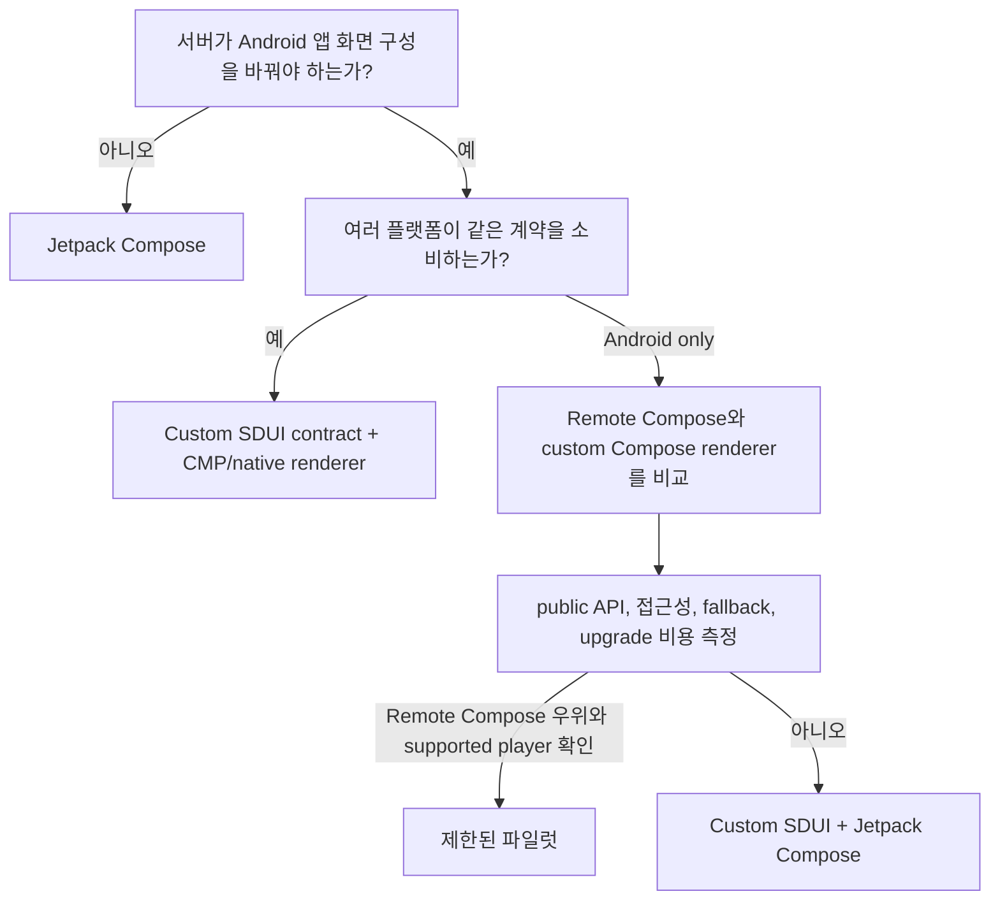

# Compose·Server-Driven UI 비교

## 비교표

| 기술 | 실행 위치 | 전달물 | 플랫폼 | 적합한 문제 |
|---|---|---|---|---|
| Jetpack Compose | Android 앱 프로세스 | 컴파일된 Kotlin/DEX | Android | 일반 Android 앱 화면 |
| Compose Multiplatform | 각 target 앱 프로세스 | target별 컴파일 결과 | Android/iOS/desktop/web | UI 소스와 로직 공유 |
| AndroidX Remote Compose | Android embedded player | binary operation document | Android 중심 | 제한된 Android player가 server-driven document를 평가 |
| Custom JSON/Proto SDUI | 제품별 app renderer | 제품 소유 schema | 원하는 플랫폼 | 서버가 화면 구성을 제어하고 계약을 직접 소유 |
| WebView | 앱 내부 web engine | HTML/CSS/JS | Android/iOS 등 | 사실상 web app을 내장해야 하는 경우 |

## 자주 발생하는 오해

### “Remote Compose는 Compose 코드를 서버에서 보낸다”

아니다. Kotlin lambda나 arbitrary bytecode가 아니라 허용된 operation document를 보낸다.

### “CMP를 쓰면 Remote Compose binary를 iOS에서도 그릴 수 있다”

아니다. CMP는 source sharing 기술이고 AndroidX Remote Compose player의 cross-platform 구현이 아니다.

### “Ktor가 Remote Compose server framework다”

Ktor는 HTTP, auth, cache, serialization을 제공한다. document schema, player profile, component support, action security는 별도 책임이다.

### “state 값이 바뀌면 화면도 반드시 바뀐다”

alpha14 POC에서는 그렇지 않았다. integer action은 성공했지만 일부 dynamic text output은 stale했다. state와 rendered semantics/text를 각각 검증해야 한다.

## 선택 기준

## Remote Compose와 custom SDUI

| 질문 | Remote Compose | Custom SDUI |
|---|---|---|
| protocol owner | AndroidX | 제품 팀 |
| Android 표현력 | operation/profile 범위 | renderer 구현 범위 |
| iOS/CMP 재사용 | binary 직접 재생 불가 | 공통 schema로 가능 |
| schema 진화 | AndroidX release/profile 종속 | 제품이 통제 |
| action | host allowlist 필요 | command allowlist 필요 |
| debugging | alpha preview/testing + source 분석 | 자체 inspector 필요 |
| fallback | 제품이 구현 | 제품이 구현 |
| 현재 blocker | restricted player/JVM DSL, alpha behavior | 초기 renderer/contract 비용 |

## 권고

- Android-only POC에서는 같은 상태 화면을 두 renderer로 구현해 비교한다.
- CMP가 필요하면 공통 계층은 제품 contract와 validation으로 제한한다.
- Remote Compose는 arbitrary server code가 아니라 제한된 document compiler로 취급한다.
- WebView는 요구사항이 native SDUI가 아니라 web delivery일 때만 선택한다.

## 공식 근거

- [Remote Compose release](https://developer.android.com/jetpack/androidx/releases/compose-remote)
- [CMP FAQ](https://kotlinlang.org/docs/multiplatform/faq.html)
