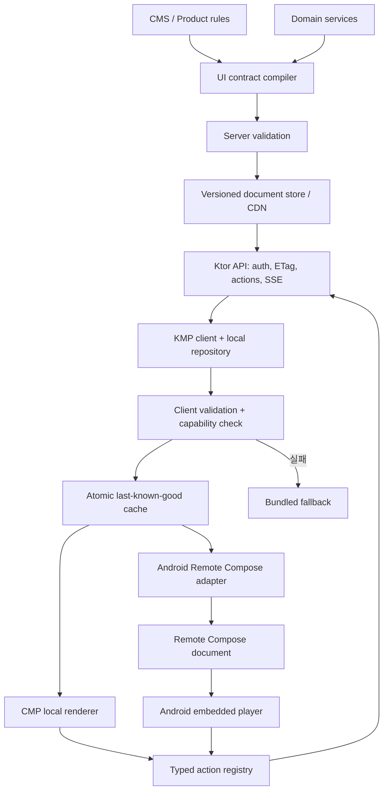

# 권장 레퍼런스 아키텍처

## 결정

기본안은 **contract-first dual renderer**다.

- 제품 소유의 고수준 `UiDocument`가 source of truth다.
- Ktor는 문서·manifest·action을 전달한다.
- CMP renderer는 Android/iOS/desktop/web 앱 화면을 그린다.
- Android Remote Compose adapter는 Android 앱 내부 실험용 document/player 경계를 만든다.
- 모든 renderer 앞에 동일한 validator와 capability negotiation을 둔다.

## 전체 구조



## 계층 책임

### UI contract

- 제품 의미와 허용 component/action 정의
- schema version과 migration
- accessibility label, localization key, design token
- 데이터와 레이아웃의 경계
- platform capability에 따른 fallback

Compose, Android `Context`, Ktor server class에 의존하지 않는다.

### Ktor API

- identity/authorization
- content negotiation
- ETag/Cache-Control
- capability 기반 문서 선택
- action idempotency와 audit
- rollout, experiment, kill switch

### client repository

- manifest와 payload fetch
- size/hash/time/version 검증
- cache transaction
- last-known-good 선택
- metrics와 fallback reason

### CMP renderer

- semantic component를 platform-friendly Compose UI로 변환
- native interop와 platform navigation
- screen reader, input, safe area

### Android embedded Remote Compose adapter

- `UiDocument`의 허용 subset만 Remote Compose DSL/procedural writer로 변환
- profile/API level validation
- Remote state/action mapping
- preview, screenshot, player compatibility test
- AndroidX alpha dependency 격리

## 요청·응답 흐름

1. client가 capability hash, app build, locale, theme, viewport를 보낸다.
2. server가 지원 가능한 contract/profile 조합을 선택한다.
3. client는 ETag가 있는 manifest와 payload를 받는다.
4. repository가 network limit → envelope → hash → schema → resource → action 순으로 검증한다.
5. 새 candidate를 격리된 renderer smoke test에 넣는다.
6. 성공하면 active cache로 atomic promote한다.
7. renderer는 node를 그리며 action을 typed registry에만 연결한다.
8. action registry가 local navigation 또는 authenticated server command를 실행한다.
9. 실패 단계와 document ID를 privacy-safe telemetry로 기록한다.

## 계약 예시

```json
{
  "schemaVersion": 3,
  "documentId": "home-2026-07-10-a",
  "surface": "home",
  "tokens": {
    "colorScheme": "brand-default",
    "spacingScale": "v2"
  },
  "body": {
    "type": "hero",
    "title": {"textKey": "home_welcome"},
    "media": {"assetId": "welcome_summer", "altTextKey": "welcome_summer_alt"},
    "primaryAction": {
      "type": "open_catalog",
      "catalogId": "summer"
    }
  },
  "fallback": {"bundledKey": "home.default"}
}
```

이는 예시 계약이며 구현을 위한 확정 schema는 아니다. 중요한 점은 raw Compose class/modifier가 아니라 제품 의미와 제한된 action을 표현한다는 것이다.

## 디자인 토큰

서버가 raw ARGB, font file, dp를 모두 결정하게 하지 않는다.

- server: semantic token name과 선택적 안전한 override
- client: token registry와 platform adaptation
- unknown token: documented fallback
- font: bundled/system allowlist 우선
- image: asset ID → 검증된 CDN resolver

이렇게 해야 theme, dark mode, dynamic type, accessibility contrast, 브랜드 교체를 client가 안전하게 유지할 수 있다.

## rollout

문서 배포 단위:

```text
schemaVersion + surface + audience + documentRevision + rendererCapabilities
```

순서:

1. internal dogfood
2. 1% canary
3. renderer/profile별 cohort 확대
4. KPI와 fallback rate 관찰
5. 자동 또는 수동 rollback 가능 상태 유지

app release와 document release는 독립적이므로 server가 N, N-1 client contract를 동시에 제공하는 기간을 둔다.

## Remote Compose binary를 서버에서 바로 만들 때

허용 조건:

- Android 앱 내부의 비핵심 POC 화면만 target
- `remote-creation-jvm` API가 필요한 operation을 지원
- profile과 player 버전이 통제됨
- source-level restricted/public API 검토 완료
- 생성 결과가 deterministic하고 golden/semantic test 가능

그렇지 않다면 server는 고수준 contract만 발행하고 Android 쪽 adapter 실험은 supported public app player가 확인될 때까지 격리한다.

## 비목표

- 원격 Kotlin/JavaScript 실행
- 서버가 임의 native API 호출
- 모든 Compose `Modifier` 직렬화
- 하나의 pixel-perfect 문서를 모든 플랫폼에서 동일 렌더링
- critical login/payment 화면 전체를 첫 실험 surface로 전환

## 판단 근거

- AndroidX Remote Compose는 alpha14이며 Android player 공개 범위가 제한적이다.
- CMP는 공통 player가 아니라 각 target에 컴파일되는 UI framework다.
- Ktor client와 serialization은 공통 계약 전송에 적합하다.
- offline-first와 last-known-good가 원격 UI의 blast radius를 줄인다.

구체적 실행 순서는 [파일럿 계획](pilot-plan.md), 검증 항목은 [테스트와 운영](testing-and-operations.md)을 따른다.
