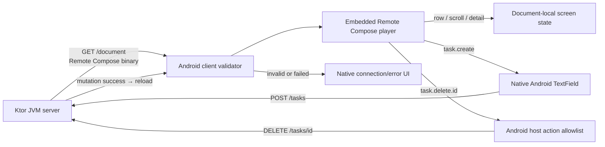
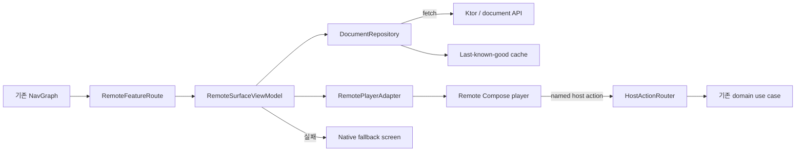

# 서버가 UI를 보내면 Android 앱은 어디까지 할 수 있을까?

AndroidX Remote Compose `1.0.0-alpha14` POC 회고와 학습 포인트

## 먼저 결론

이번 POC에서는 Ktor JVM 서버가 현재 task 목록으로 Remote Compose binary document를 생성하고, Android 앱이 이를 내려받아 풀스크린으로 렌더링했다. 목록·스크롤·상세 화면은 Remote Compose가 담당하고, 직접 타이핑은 native Android TextField가 담당한다. 생성·삭제 intent는 named host action을 거쳐 Ktor API로 실행되고 성공 즉시 새 문서를 받는다.

기술적으로는 동작했다. 하지만 2026-07-11 기준으로 핵심 player와 JVM 생성 API가 `LIBRARY_GROUP` restricted 상태이고, alpha14에서 state 표시와 density 처리의 불일치도 직접 경험했다. 따라서 현재 결론은 다음과 같다.

> Remote Compose는 “서버에서 Kotlin UI 코드를 실행하는 기술”이 아니라, 서버가 생성한 제한된 UI operation 문서를 Android player가 해석하는 기술이다. 학습과 Android-only 실험에는 흥미롭지만, 현재 POC를 그대로 production SDUI 기반으로 채택하기에는 API 안정성과 운영 계약이 부족하다.

## 출발점: 우리가 확인하고 싶었던 것

처음 상상한 모습은 단순했다.

1. 앱에서 로컬 Ktor 서버 주소로 연결한다.
2. 서버가 화면을 내려보낸다.
3. 앱이 그 화면을 전체 화면으로 그린다.
4. 내려받은 화면 안에서 상태를 변경한다.
5. 필요한 경우 서버 API도 호출한다.

이 질문을 실제 구현 문제로 바꾸면 다음 네 가지가 된다.

- 서버는 어느 정도까지 UI를 결정할 수 있는가?
- 상태는 서버, 문서, Android 앱 중 어디에 존재하는가?
- Remote Compose 문서가 직접 API를 호출할 수 있는가?
- 앱에 내장할 만큼 API와 wire format이 안정적인가?

이번 POC는 이 질문을 확인하기 위해 “한국 Android 개발자의 배포 작업” 화면을 만들었다. 사용자는 직접 작업 이름을 입력해 Ktor 서버 목록에 추가하고, Remote Compose 목록을 스크롤하며 상세 화면으로 이동하거나 항목을 삭제할 수 있다. mutation 뒤에는 별도 동기화 버튼 없이 revision이 증가한 새 문서를 자동으로 받는다.

## Android Compose 개발자가 보는 기본 UI API

Remote Compose의 procedural DSL은 Compose와 이름이 비슷하지만 실행 방식은 다르다. 일반 Compose 함수는 앱 안에서 recomposition을 수행한다. Remote Compose DSL은 서버에서 호출될 때 layout·text·state·action operation을 binary document에 기록하고, Android player가 나중에 이를 해석한다.

| UI 의도 | Jetpack Compose | Remote Compose alpha14 procedural DSL | 이번 POC에서의 사용 |
|---|---|---|---|
| 겹쳐 배치 | `Box { ... }` | `Box { ... }` | 배경과 화면 root |
| 세로·가로 배치 | `Column`, `Row` | `Column`, `Row` | 목록, 상세, 버튼 |
| 흐름 배치 | `FlowRow` | `Flow` | chip류 배치 가능성 확인 |
| 글자 | `Text(text, fontSize = 18.sp)` | `Text(text, fontSize = 18.rsp)` | 제목, task, 설명 |
| 이미지·직접 그리기 | `Image`, `Canvas` | `Image`, `Canvas` | alpha14 기본 surface 확인 |
| 여백·배경 | `Modifier.padding(16.dp).background(...)` | `Modifier.padding(16f).background(...)` | 문서 전체 spacing과 색상 |
| 고정 크기 | `Modifier.height(76.dp)` | `Modifier.height(76f)` 또는 `height(RcFloat)` | row 높이는 density expression 사용 |
| 스크롤 | `verticalScroll(...)`, `LazyColumn` | `Modifier.verticalScroll()` | 12개 task scroll 검증; lazy list는 아님 |
| 클릭과 local 변경 | `clickable { state = ... }` | `onClick { setValue(state, value) }` | 목록 ↔ 상세 전환 |
| 앱 기능 요청 | callback에서 ViewModel 호출 | `onClick { hostAction("name") }` | native 입력창, create/delete API 연결 |
| 조건부 화면 | `if`, `when`, Navigation Compose | `StateLayout(stateIndex)` | 0은 목록, 1..N은 상세 |
| local state 선언 | `remember { mutableStateOf(...) }` | `remoteNamedInteger("screen", 0)` | 문서 내부 화면 위치 |
| 글자 입력 | `TextField` | 이번 alpha14 surface에서 확인하지 못함 | native Compose dialog로 보완 |

이 대응표에서 특히 주의할 점은 `18.sp`와 `18.rsp`, `76.dp`와 `76f`가 같은 체감 크기를 보장하지 않았다는 것이다. 이름이 비슷하다고 Android Compose의 unit·recomposition·navigation semantics까지 같다고 가정하면 안 된다. 이 차이가 실제 typography와 상태 디버깅의 출발점이었다.

## 최종 POC 구조



앱의 첫 화면은 native Jetpack Compose로 만들었다. 여기서는 서버 URL, loading, connection error를 다룬다. 문서 다운로드와 validation이 성공하면 Remote Compose player 화면으로 전환한다. 시스템 뒤로가기를 누르면 player를 닫고 연결 화면으로 돌아간다.

이 경계를 둔 이유는 명확하다.

- 네트워크 실패 전에 remote UI가 존재한다고 가정할 수 없다.
- 연결·fallback·재시도는 host 앱이 통제해야 한다.
- 서버 문서가 깨져도 앱 자체의 복구 UI는 남아 있어야 한다.
- remote screen의 수명주기와 Android navigation을 분리할 수 있다.

실행 코드는 [remote-state-lab 샘플](../../samples/remote-state-lab/README.md)에 있다.

## 상태관리는 어떻게 했는가?

이번 POC는 상태를 한곳에 억지로 모으지 않고, 수명과 책임에 따라 네 경계로 나눴다.

| 상태 | 소유자 | 예시 |
|---|---|---|
| 연결 상태 | Android ViewModel | URL, loading, error, connected |
| 문서 local state | Remote Compose player | 현재 list/detail screen, player의 scroll 위치 |
| 입력 state | Android Compose | TextField draft, dialog, validation |
| server state | Ktor process | stable task ID, title, document revision |

초기에는 미리 준비된 몇 개 항목의 표시 여부만 바꾸는 데모를 만들었다. 버튼과 local state plumbing을 확인하기에는 빨랐지만, 사용자가 제목을 직접 입력할 수도 없고 목록을 계속 늘릴 수도 없었다. 이 구현은 실제 요구를 만족하지 못해 폐기했다. 현재는 Ktor `TaskStore`가 task를 보유하고 `/document` 요청마다 N개 row와 N개 detail 화면을 만든다. 고정된 business 개수 제한은 없다.

Remote Compose local state는 task 데이터가 아니라 **현재 어느 화면을 보여 줄지**에만 썼다. 실제 구현의 핵심만 줄이면 다음 구조다.

```kotlin
val screen = remoteNamedInteger("screen", 0)

StateLayout(stateIndex = screen, modifier = Modifier.fillMaxSize()) {
  TaskListScreen(...)
  snapshot.tasks.forEachIndexed { index, task ->
    TaskDetailScreen(task = task, ...)
  }
}

// 목록의 각 row
Modifier.onClick {
  setValue(screen, index + 1)
}

// 상세의 "목록으로"
Modifier.onClick {
  setValue(screen, 0)
}
```

Android Compose로 옮겨 생각하면 아래와 비슷하다.

```kotlin
var screen by remember { mutableIntStateOf(0) }

when (screen) {
  0 -> TaskList(onTaskClick = { screen = it + 1 })
  else -> TaskDetail(onBack = { screen = 0 })
}
```

다만 Remote Compose에서는 이 코드가 앱에서 composable로 실행되는 것이 아니다. 서버가 `screen` state와 각 화면의 operation을 문서에 기록하고, player가 `setValue` action을 처리해 표시할 `StateLayout` child를 바꾼다. Navigation Compose의 back stack을 사용한 것도 아니다.

목록 데이터 변경은 서버 mutation이다. native dialog에서 입력한 값은 `POST /tasks`, 삭제는 `DELETE /tasks/{id}`로 전달되고 성공하면 Android가 최신 문서를 자동으로 받는다. 따라서 서버 목록과 화면 목록의 source of truth가 분리되지 않는다.

| 사용자 행동 | 상태가 바뀌는 곳 | 결과 |
|---|---|---|
| task row 선택 | Remote document의 `screen` | 네트워크 없이 상세 화면 표시 |
| `목록으로` 선택 | Remote document의 `screen` | 네트워크 없이 목록 표시 |
| `새 작업 작성` 선택 | named host action → Android | native TextField dialog 표시 |
| 작업 저장 | Android → `POST /tasks` → Ktor | revision 증가 후 `/document` 자동 재요청 |
| 작업 삭제 | named host action → Android → Ktor | ID 검증과 삭제 후 새 문서 자동 재요청 |

새 문서를 받으면 이전 Remote document instance가 교체되므로 document-local `screen`과 scroll 상태도 새 문서의 초기값으로 돌아간다. 이 POC에서는 mutation 뒤 목록으로 복귀하는 것이 의도한 UX였지만, 편집 중 상태 보존이 필요한 제품이라면 restore 계약을 별도로 설계해야 한다.

과거 POC에서 mutable integer 값이 변경돼도 `TextLookupInt`와 derived expression text가 이전 값을 유지한 현상은 여전히 중요한 디버깅 증거다. 현재 구조는 mutable list label을 player 안에서 계산하지 않고 server snapshot의 static text로 생성해 그 문제를 피한다.

이 경험에서 얻은 핵심 교훈은 다음과 같다.

> 상태 값이 바뀌었다는 사실과 사용자에게 바뀐 화면이 보인다는 사실은 별개의 검증 항목이다.

## 서버 UI 코드에서 API 요청도 할 수 있는가?

직접적인 의미에서는 아니다.

Remote Compose document가 임의 URL로 Ktor 요청을 보내거나 Android의 suspend 함수를 실행하게 만들지 않았다. 문서는 `task.create` 또는 `task.delete.<id>` intent만 발생시킨다. Android 앱은 정확한 create 이름과 양의 정수 delete ID를 검증한 뒤 API를 호출한다.

```text
Remote document
  ├─ hostAction("task.create")
  │    └─ Android TextField → POST /tasks
  └─ hostAction("task.delete.42")
       └─ Android allowlist → DELETE /tasks/42
            └─ GET /document
```

이 구조는 불편해 보이지만 중요한 보안 경계다. 서버가 내려보낸 문서가 임의의 Activity, URL, 권한 기능을 호출할 수 있다면 remote UI는 사실상 원격 코드 실행 계층에 가까워진다. Host 앱은 다음을 계속 소유해야 한다.

- 인증과 인가
- action payload validation
- navigation
- retry와 idempotency
- analytics와 audit
- 권한 요청
- 사용자 데이터 접근

alpha14 procedural component surface에서는 일반 앱의 TextField에 해당하는 IME input을 확인하지 못했다. 그래서 입력을 native host로 옮겼다. 삭제 ID는 action 이름에 포함하되 router가 양의 정수만 허용한다. 더 복잡한 form이라면 typed payload, authentication, state restore 계약이 필요하다.

## 가장 어려웠던 부분

### 1. 문서보다 source code가 더 정확한 순간이 많았다

dependency는 Google Maven에서 받을 수 있었지만, `RemoteDocumentPlayer`, View player, `createRcBuffer`, procedural DSL의 핵심 surface는 alpha14 source에서 `LIBRARY_GROUP` restricted였다.

“artifact를 받을 수 있음”과 “일반 앱에서 지원되는 public API임”은 같지 않다. 최신 release note, API reference, artifact, 고정 source commit을 함께 읽어야 현재 사용 가능 범위를 판단할 수 있었다.

### 2. 클릭 성공과 화면 갱신을 분리해서 추적해야 했다

초기 `+` 버튼은 아무 반응이 없는 것처럼 보였다. Android CLI semantics에는 clickable로 나타났고, runtime context를 확인하니 값도 `3 → 4`로 변했다. 문제는 `TextLookupInt`, `TextFromFloat`, derived `StateLayout` index가 이전 표시를 유지한 것이었다.

덕분에 테스트를 다음처럼 분리해야 한다는 것을 배웠다.

1. hit target이 존재하는가?
2. action이 실행됐는가?
3. state 값이 바뀌었는가?
4. layout/text/semantics가 새 값을 반영했는가?
5. 다음 화면과 refresh 뒤에도 일관적인가?

### 3. `scaledSp`가 필요해질 때까지의 density 트러블슈팅

실제 기기에서 가장 먼저 보인 증상은 **Remote 화면의 글자가 native 연결 화면보다 지나치게 작은 것**이었다. 단순히 font 숫자를 키우는 것으로 시작했지만 padding, row 높이, 글자가 서로 다른 비율로 바뀌어 일부 설명이 잘리는 새 문제가 생겼다.

| 단계 | 관찰과 시도 | 판정 |
|---|---|---|
| 1. 초기 렌더 | `fontSize = 18.rsp`가 Android의 `18.sp`보다 훨씬 작게 보였다 | 두 unit이 같은 체감 크기일 것이라는 가정이 틀렸다 |
| 2. 숫자만 확대 | 주요 `rsp` 값을 올리면 한 기기에서는 나아졌지만 일관된 규칙이 없었다 | device density가 달라지면 다시 어긋날 임시 조치였다 |
| 3. DP behavior 지정 | `DOC_DENSITY_BEHAVIOR_DP`를 넣자 padding과 rounded clip은 커졌다 | 문서 metadata는 필요하지만 font와 exact size까지 모두 해결하지 않았다 |
| 4. 새 layout 이상 | density가 반영된 padding 안에서 고정 row height와 작은 font가 섞여 summary/subtitle이 잘렸다 | 한 문서 안에 서로 다른 scale 규칙이 공존했다 |
| 5. source와 runtime 대조 | text font size는 raw 값에 가깝게 전달되고 exact dimension도 자동 density 배율을 받지 않는 경로를 확인했다 | font와 fixed dimension을 명시적으로 보정해야 했다 |
| 6. system density 사용 | player의 `density()`를 font와 exact size 계산에 사용했다 | 1080×2400 emulator에서 native 화면과 비슷한 체감 크기와 정상 row 배치를 확인했다 |

그래서 최종 문서 builder에 다음 helper를 만들었다.

```kotlin
private fun scaledSp(density: RcFloat, value: Float): RcSp =
  RcSp((density * value).toFloat())
```

이 함수의 목적은 단순히 `Float`를 `RcSp`로 포장하는 것이 아니다.

1. `density`는 서버 JVM의 density가 아니라 **문서를 재생하는 player가 제공하는 system value**다.
2. `density * value`는 서버에서 즉시 계산되는 일반 `Float`가 아니라 Remote Compose expression이다.
3. 그 expression 참조를 `RcSp`로 넘기면 player가 실행 시점의 density로 실제 font size를 계산한다.
4. 따라서 `scaledSp(density, 18f)`는 이번 POC 환경에서 Android의 `18.sp`와 가까운 체감 크기를 만들기 위한 명시적 보정이다.

사용부는 다음처럼 모든 typography token을 한곳에서 만든다.

```kotlin
val density = density()
val metrics = Metrics(
  eyebrow = scaledSp(density, 14f),
  title = scaledSp(density, 38f),
  body = scaledSp(density, 17f),
  taskTitle = scaledSp(density, 18f),
)

val rowHeight = (density * 76f).flush()
```

fixed dimension에는 `RcFloat` expression을 사용하고 `flush()`해서 중간 expression을 문서에 materialize했다. 긴 expression serialization 제한을 피하고 여러 modifier에서 안정적으로 재사용하기 위해서다.

중요한 한계도 있다. 이 helper는 **POC에서 관찰한 density 불일치를 보정한 workaround**이지, Android Compose의 `sp`와 font scale semantics가 완전히 동일하다는 보장이 아니다. 특히 사용자의 글꼴 크기 설정, 비선형 font scaling, mdpi/xhdpi/xxhdpi 조합은 아직 검증하지 못했다. production 판단 전에는 이 helper를 전제로 고정하지 말고 다음 alpha의 unit 처리와 font-scale matrix를 다시 확인해야 한다.

### 4. 미리 준비한 목록은 실제 입력 요구를 만족하지 못했다

초기 데모는 정해진 항목의 표시 여부만 local state로 바꾸는 방식이었다. 클릭과 화면 갱신을 빠르게 검증할 수는 있었지만, 사용자가 새 제목을 입력하거나 서버에 임의 개수의 task를 쌓는 제품 흐름으로 확장할 수 없었다. 그래서 task 데이터는 Ktor `TaskStore`로 옮기고, 서버 snapshot의 N개 task를 N개 row와 detail 화면으로 만드는 문서로 교체했다. 이 구조로 직접 입력, 12개 목록, scroll, 상세, 삭제를 검증했다.

그러나 현재 문서는 lazy list가 아니다. 모든 row와 detail state가 binary에 들어가므로 task 수에 비례해 payload와 operation이 증가한다. “고정 네 개 제한 없음”과 “물리적 무한 목록”은 구분해야 하며 512 KiB client limit은 안전을 위해 유지한다.

POC가 “동작했다”는 말에는 반드시 어떤 제한과 우회로 동작했는지를 함께 적어야 한다.

### 5. 서버 실행 수명주기도 개발 경험의 일부였다

기존 Ktor 서버를 종료하지 않고 다시 실행해 `BindException: Address already in use`가 발생했다. Remote Compose 문제가 아니라 개발 서버 lifecycle 문제였지만, 새로운 기술 POC에서는 이런 주변 마찰도 전체 난이도로 체감된다.

최종 샘플에는 8080 점유 확인 절차를 남기고 검증 종료 후 서버를 정리했다.

## 이번 POC에서 실제로 확인한 것

다음 항목은 emulator와 테스트로 확인했다.

- native 연결 화면 → remote document 전환
- standalone JVM에서 deterministic document 생성
- Ktor binary fetch와 Android parser validation
- 풀스크린 embedded player 렌더링
- native TextField에 직접 입력한 task의 서버 저장
- mutation 뒤 `R1·3개 → R2·4개` 자동 document reload
- 12개 server-backed row와 Remote Compose vertical scroll
- direct `StateLayout(screen)` 목록 ↔ 상세 Navigation
- 입력 task의 server ID/detail 표시
- 상세 삭제 뒤 `R10·12개 → R11·11개` 자동 reload
- create/delete named host action allowlist와 ID validation
- 뒤로가기 후 native 연결 화면 복귀
- server/app unit test, debug APK assemble, Android lint


상세 검증 증거는 [직접 입력·가변 목록·상세 화면 검증](../raw/remote-dynamic-task-flow-verification-2026-07-11.md)에 있다.

## 확인하지 못한 것

다음 항목은 아직 성공으로 주장할 수 없다.

- supported public embedded player API
- producer/player N/N-1 wire compatibility
- Remote Compose 내부 TextField/IME 입력
- lazy/virtualized 대규모 remote list
- local state payload의 typed server 전송과 복원
- process death와 disk-backed last-known-good
- malformed/fuzz/resource exhaustion 방어
- TalkBack, font scale, RTL, locale matrix
- 저사양 기기의 first render, jank, memory budget
- signed document와 production rollout/rollback
- iOS/desktop용 공통 Remote Compose player

즉, 이번 결과는 feasibility POC이지 production readiness 증명이 아니다.

## 이 POC로 공부할 수 있는 주제

### UI framework보다 interpreter 관점

Remote UI를 도입하면 앱은 단순한 화면 구현체가 아니라 외부 문서를 해석하는 interpreter가 된다. parser limit, version negotiation, capability, fallback, cache, telemetry가 UI 코드만큼 중요해진다.

### 상태의 위치와 수명

native state, document-local state, server state가 동시에 존재한다. refresh, process death, app upgrade 때 어느 상태를 보존할지 계약하지 않으면 사용자의 편집 내용이 사라지거나 서버와 화면이 어긋난다.

### Host action은 보안 API

action 이름은 단순 callback 문자열이 아니라 권한 경계다. typed allowlist, payload 검증, 재인가, audit가 필요하다. 서버 UI가 앱 기능을 자유롭게 호출하도록 만들면 안 된다.

### SDUI의 비용은 renderer보다 운영 계약에 있다

문서를 그리는 데 성공한 뒤에도 version, rollback, last-known-good, kill switch, accessibility, observability가 남는다. production SDUI의 진짜 난이도는 화면 DSL보다 이 운영 계층에 있다.

### Android 전용 기술과 멀티플랫폼 계약의 구분

Remote Compose binary는 Compose Multiplatform UI source가 아니다. Android+iOS/desktop 공통 제품이라면 제품 소유의 고수준 `UiDocument`를 먼저 정의하고 target별 renderer를 두는 편이 현실적이다. Remote Compose는 Android adapter 실험으로 격리할 수 있다.

### Alpha API를 평가하는 방법

release note만 읽는 것으로 충분하지 않았다. Maven artifact, API annotation, 고정 source, runtime tree, semantics, 실제 device screenshot을 함께 봐야 했다. 새로운 AndroidX 기술을 검토할 때 재사용할 수 있는 조사 방법이다.

## 월요일 소개용 10분 진행 순서

### 1분 — 문제 제시

“앱 업데이트 없이 서버가 Android 화면과 일부 상태 흐름을 바꿀 수 있을까?”라는 질문으로 시작한다. Remote Compose를 원격 Kotlin 실행이 아니라 binary UI document와 player라고 설명한다.

### 2분 — UI API와 실행 모델

앞의 API 대응표를 보여 주며 `Column`, `Row`, `Text`, `Modifier`는 익숙하지만 composable을 내려보내는 것이 아니라 operation document를 만든다고 설명한다. 이어서 `remember`/`when`에 대응하는 `remoteNamedInteger`/`StateLayout` 코드로 목록과 상세 전환을 보여 준다.

### 3분 — 라이브 데모

1. Ktor 서버 실행
2. 앱의 서버 연결 화면 확인
3. `서버 연결` 선택
4. `새 작업 작성`에서 직접 타이핑
5. 저장 후 `R1·3개 → R2·4개` 자동 갱신 확인
6. 입력한 row 선택 후 Remote Compose 상세 화면 확인
7. `← 목록`과 scroll 시연
8. 상세에서 삭제 후 자동 목록 복귀 확인

### 2분 — 상태와 API 경계

목록/detail Navigation은 document-local state이고, 데이터 create/delete는 named action → Android allowlist → Ktor로 이동한다고 설명한다. “왜 입력창은 native인가?”에는 alpha14 remote TextField/IME surface가 없기 때문이라고 답한다. 수동 sync는 없고 mutation 뒤 자동 reload한다.

### 1분 — 가장 큰 디버깅 교훈

버튼 action은 성공했지만 text가 stale했던 사례와, `rsp`/exact size/padding의 density 불일치를 보여 준다. 상태 correctness와 visual correctness를 별도로 검증해야 했다고 설명한다.

### 1분 — 최종 판단

학습용 POC는 성공했지만 restricted alpha API, remote text input 부재, non-lazy growing document, 운영 gate 때문에 production 채택은 보류한다고 정리한다.

## 예상 질문과 답변

### Q. 서버에서 Compose 코드를 내려받아 실행한 것인가?

아니다. 서버 JVM에서 DSL을 실행해 binary operation document를 만들고 Android player가 문서를 해석했다. Kotlin bytecode나 composable source를 원격 실행하지 않았다.

### Q. 화면 안에서 상태관리가 가능한가?

가능했다. 현재 screen index를 local state로 두어 목록과 상세를 전환했다. task 데이터 자체는 Ktor server가 소유하고 mutation 뒤 새 문서를 받는다. 과거 mutable text 실험에서는 stale 표시 이슈가 재현됐다.

### Q. Remote Compose 안에서 직접 타이핑할 수 있는가?

alpha14 procedural DSL/source에서는 일반 앱 TextField에 해당하는 IME input component를 확인하지 못했다. 그래서 remote action이 native Android TextField를 열고 입력 결과를 서버에 저장한다.

### Q. 목록은 정말 무제한인가?

고정 네 개의 business cap은 제거했고 12개 scroll과 25개 server store test를 확인했다. 하지만 모든 row/detail이 문서에 들어가므로 물리적 무한 목록은 아니다. 512 KiB 안전 한도 내의 growing finite list이며 큰 데이터는 pagination이나 lazy renderer가 필요하다.

### Q. 화면에서 API 요청도 가능한가?

문서가 직접 임의 요청을 보내게 하지 않았다. named action을 Android host에 전달하고 allowlist된 action만 Ktor API로 연결했다.

### Q. 그럼 JSON SDUI보다 좋은가?

아직 단정할 수 없다. AndroidX player가 layout/state/drawing interpreter를 제공한다는 장점이 있지만, 현재 public API 안정성·debuggability·wire compatibility가 약하다. 제품 소유 계약과 custom renderer를 함께 비교해야 한다.

### Q. Compose Multiplatform에서도 같은 문서를 쓸 수 있는가?

이번 검증 범위에서는 아니다. Remote Compose와 CMP는 목적과 실행 모델이 다르다. 공통 제품 계약이 필요하면 고수준 `UiDocument`와 target별 renderer가 더 안전한 기본안이다.

### Q. 지금 production에 써도 되는가?

이번 POC 기준으로는 권하지 않는다. 핵심 API restriction, alpha churn, 접근성·fallback·fuzz·compatibility 검증 부족 때문이다. 비핵심 internal experiment 정도가 현재의 적절한 범위다.

## 다음 POC에서 비교할 것

가장 가치 있는 다음 단계는 기능을 더 추가하는 것이 아니라 같은 화면을 두 방식으로 구현해 비교하는 것이다.

1. Remote Compose renderer
2. 제품 소유 JSON/Proto `UiDocument` + Jetpack Compose renderer

비교 지표는 다음과 같다.

- 구현과 디버깅 시간
- document 크기와 first render
- state/action correctness
- TalkBack, font scale, RTL
- unknown component와 malformed document 처리
- offline cache와 rollback
- renderer N/N-1 compatibility
- API publicness와 upgrade 비용

Remote Compose의 다음 alpha가 나오면 stale text, derived state, nested layout, density와 함께 public TextField/IME 및 lazy list surface가 추가됐는지 확인해야 한다.

## 기존 Android 앱에 도입하려면 무엇을 고려하고 공부해야 하는가?

아래 내용은 AndroidX의 공식 production 아키텍처 보장이 아니라, 이번 alpha14 POC에서 얻은 증거를 기존 Android 앱 구조에 적용한 engineering recommendation이다.

가장 먼저 바꿔야 할 관점은 “기존 Compose 화면을 Remote Compose로 교체한다”가 아니다. **기존 앱의 Navigation, ViewModel, domain use case, 인증, 네트워크 계층은 유지하고 Remote Compose를 격리된 renderer로 추가한다**고 생각하는 편이 안전하다.



여기서 `RemotePlayerAdapter`는 alpha/restricted API 의존성을 앱 전체에 퍼뜨리지 않는 격리 계층이다. `HostActionRouter`는 remote document의 문자열을 곧바로 Activity, NavController, Repository 호출로 연결하지 않고, 허용된 command만 기존 use case로 변환하는 경계다.

### 도입 전에 검토하고 공부할 영역

| 영역 | 먼저 답해야 할 질문 | 공부하고 검증할 내용 |
|---|---|---|
| 도입 화면 선정 | 장애가 나도 로그인·결제·핵심 업무를 막지 않는가? | read-only 또는 비핵심 화면부터 시작하고 native fallback을 같은 route에 유지한다 |
| API 안정성 | 사용하는 player와 JVM builder가 supported public API인가? | release note, API annotation, 고정 source, Maven version을 함께 확인하고 alpha API는 adapter module에만 둔다 |
| 문서 계약 | 서버 문서와 앱 player 버전이 다르면 어떻게 되는가? | document/profile version, capability negotiation, unknown operation 정책, N/N-1 downgrade를 정의한다 |
| 상태 소유권 | refresh와 process death 뒤 무엇을 복원해야 하는가? | 화면 선택은 document-local, 입력 초안은 native, business data는 server처럼 상태별 source of truth와 수명을 먼저 표로 만든다 |
| Navigation | Remote 상세 화면과 앱 route를 어디서 나눌 것인가? | 짧은 문서 내부 전환은 `StateLayout`, deep link·권한·다른 feature 이동은 기존 `NavController`가 담당하도록 경계를 정한다 |
| 사용자 입력 | TextField, 키보드, validation을 어느 쪽이 소유하는가? | 현재 확인되지 않은 remote IME surface에 의존하지 말고 native form과 typed result 계약을 우선 검토한다 |
| Host action | 서버가 어떤 앱 기능을 요청할 수 있는가? | action allowlist, typed payload, 길이·ID validation, 사용자 재인가, idempotency, 중복 탭과 retry를 설계한다 |
| 기존 domain 연결 | Remote 화면이 Repository를 직접 호출해도 되는가? | action을 기존 use case로 변환해 동일한 business rule, auth, analytics를 재사용한다. UI 문서가 domain 계층을 우회하지 않게 한다 |
| 오류와 offline | 서버가 느리거나 문서가 깨졌을 때 무엇을 보여 주는가? | timeout, loading, bundled fallback, last-known-good, cache corruption, atomic promote, retry UX를 공부한다 |
| 보안과 개인정보 | 문서를 신뢰할 수 있는 일반 API 응답으로 봐도 되는가? | 크기·operation·depth·resource limit, HTTPS, hash/signature 필요성, URL/action allowlist, cache와 log의 개인정보를 검토한다 |
| 디자인 시스템 | 서버가 색상·크기·폰트를 마음대로 내려도 되는가? | raw 값보다 semantic token을 사용하고 dark theme, dynamic color, density, font scale, locale, RTL 대응 주체를 정한다 |
| 접근성 | player 결과가 기존 Compose 화면과 같은 품질인가? | content description, role, state description, traversal, TalkBack, touch target, 큰 글꼴에서 clipping을 실제 기기로 검증한다 |
| 성능과 목록 | task 수가 늘면 document가 어떻게 커지는가? | payload size, parse time, first render, memory, jank를 측정하고 non-lazy 문서는 pagination과 최대 item 수를 둔다 |
| 테스트 | parse 성공만 확인하면 충분한가? | deterministic document, operation/semantic assertion, screenshot, state 값과 표시 결과, malformed/fuzz, producer/player 호환성 matrix를 분리해 테스트한다 |
| 운영 | 잘못된 문서를 앱 배포 없이 회수할 수 있는가? | document revision, canary, cohort, telemetry, kill switch, denylist, rollback과 담당자를 정한다 |

### 기존 앱 구조에서 특히 먼저 문서화할 상태 표

Remote Compose 도입 전에 화면별 상태를 다음 형식으로 적어 보는 것이 좋다.

| 상태 예시 | 권장 소유자 | refresh | process death | 서버 동기화 |
|---|---|---|---|---|
| 연결·문서 loading/error | Android ViewModel | 유지 또는 재시도 | SavedStateHandle 정책 | 해당 없음 |
| 목록/상세의 순간적 선택 | Remote document 또는 ViewModel | UX에 따라 초기화/복원 결정 | 별도 snapshot 없으면 초기화 | 불필요 |
| TextField 입력 초안 | native Compose/ViewModel | 문서 교체와 분리 | 필요하면 SavedStateHandle | 저장 action 전에는 금지 |
| task/order 같은 업무 데이터 | Repository/server | 최신 snapshot 재조회 | repository에서 복원 | revision/ETag 또는 domain API |
| 인증·권한 | 기존 auth/domain 계층 | 기존 정책 유지 | 기존 정책 유지 | 매 action마다 재검증 |

이 표가 없으면 remote document reload가 UI 새로고침인지, navigation reset인지, 사용자의 편집 내용 삭제인지 구분하기 어렵다. 이번 POC에서는 mutation 뒤 목록으로 돌아가는 것이 의도였지만, 기존 앱의 편집·주문 화면에서는 같은 동작이 데이터 손실로 느껴질 수 있다.

### 권장 학습과 도입 순서

1. **실행 모델 학습**: composable 전송이 아니라 operation document와 player라는 점, 현재 API restriction과 wire/profile 개념을 source까지 확인한다.
2. **기존 native 기준 화면 확보**: 같은 화면을 Jetpack Compose로 먼저 유지해 기능, 접근성, 성능 비교 기준과 fallback을 만든다.
3. **한 route에 adapter로 격리**: 비핵심 화면 하나에 `RemotePlayerAdapter`, validator, size limit, native error UI를 넣는다.
4. **상태·action 계약 작성**: 각 상태의 owner와 복원 규칙을 표로 만들고, host action을 기존 use case에 typed mapping한다.
5. **실패부터 검증**: offline, timeout, malformed document, unknown action, 구버전 player, 큰 글꼴, RTL, process death를 정상 경로와 함께 테스트한다.
6. **측정 후 범위 확대**: first render, payload, crash/ANR, fallback rate, action success, 접근성 결과를 native 화면과 비교한 뒤 다음 surface를 결정한다.

처음부터 홈 전체나 핵심 transaction 화면을 원격화하는 것은 학습 범위가 너무 넓다. “서버가 문구와 component 순서를 바꾸는 비핵심 화면”처럼 실패 영향이 작고 성공 기준이 측정 가능한 surface가 첫 후보로 적합하다. 상세 architecture는 [권장 레퍼런스 아키텍처](reference-architecture.md), 방어선은 [보안과 신뢰성](security-reliability.md), 검증 matrix는 [테스트와 운영](testing-and-operations.md)을 함께 본다.

## 최종 판단

이번 POC의 가장 큰 수확은 “서버에서 화면을 보낼 수 있다”는 사실 자체가 아니다. 원격 UI가 들어오는 순간 Android UI 개발의 관심사가 다음과 같이 확장된다는 것을 실제 코드와 디버깅으로 확인한 것이다.

```text
Composable 작성
  → document 생성
  → protocol/version
  → interpreter correctness
  → state ownership
  → host action security
  → fallback/rollback
  → device-level visual verification
```

Remote Compose는 이 문제를 탐구하기에 흥미로운 기술이다. 다만 지금은 “앱 화면을 서버로 완전히 옮길 수 있는 완성된 제품 기술”보다, AndroidX가 원격 UI document와 player 모델을 어떻게 설계하고 있는지 배우는 alpha-stage 실험 도구로 보는 편이 정확하다.

## 참고 문서

- [Remote Compose 개요와 결론](overview.md)
- [Ktor → Android SDUI POC](sample-sdui-poc.md)
- [alpha14 디버깅과 컴포넌트 이슈](alpha14-debugging-and-component-issues.md)
- [권장 레퍼런스 아키텍처](reference-architecture.md)
- [보안과 신뢰성](security-reliability.md)
- [샘플 실행 가이드](../../samples/remote-state-lab/README.md)
