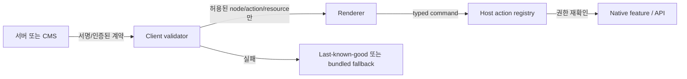

# 보안과 신뢰성

원격 UI 문서는 데이터이지만 앱의 화면, 네비게이션, 네트워크 요청, 사용자의 선택에 영향을 준다. 따라서 일반 API 응답보다 강한 신뢰 경계로 다룬다.

## 위협 모델

| 위협 | 결과 | 기본 방어 |
|---|---|---|
| 중간자/오염된 CDN | 위조 UI, phishing, 잘못된 action | HTTPS, 인증, 무결성 검증, 안전한 cache |
| 과대 문서·이미지 | OOM, ANR, 배터리 소모 | 전송·파싱·렌더링 limit |
| 깊은 중첩·복잡한 표현식 | CPU 고갈, stack/loop 문제 | depth/op/expression limit |
| 악성 host action | 권한 오용, 임의 navigation | typed allowlist와 재인가 |
| schema/profile 불일치 | crash, 빈 화면 | capability negotiation과 fallback |
| 만료/부분 배포 | 일부 사용자만 장애 | atomic rollout, last-known-good |
| 접근성 누락 | 기능적 차별과 품질 실패 | semantics/font/RTL 자동 검증 |
| 개인정보 포함 문서 | cache·log 유출 | 최소 데이터, redaction, storage policy |

## 신뢰 경계



renderer가 네트워크 payload를 바로 실행하지 않게 validator를 독립 계층으로 둔다.

## 문서 validation

render 전에 최소한 다음을 확인한다.

- 전체 byte size와 압축 해제 후 size
- media type
- schema/document API/profile
- min/max app build
- 발행·만료 시간과 clock skew 정책
- cryptographic hash; 서명이 필요한 배포 경로라면 signature와 key id
- node count, nesting depth, text length, list size
- image count, dimension, MIME, decoded memory 예산
- expression/action 수와 허용 type
- URL scheme와 host allowlist
- locale, layout direction, density 관련 필수 metadata

검증 실패는 partial render가 아니라 명시적 fallback으로 끝낸다.

## alpha14 player 내부 제한에서 얻는 교훈

[고정 source의 `Limits.java`](https://android.googlesource.com/platform/frameworks/support/+/19660b9e1b2fec4a9528fe80ce0a432c0fa2f825/compose/remote/remote-core/src/main/java/androidx/compose/remote/core/Limits.java)는 다음 기본값을 가진다.

| 항목 | source 기본값 |
|---|---:|
| 프레임당 operation | 20,000 |
| ID table entry | 1,000 |
| data map entry | 2,000 |
| state data | 10,000 |
| UTF-8 string | 4,000 bytes |
| image width/height | 8,000 px |
| player당 bitmap memory | 20 MiB |
| expression operation | 32 |
| font data | 800,000 bytes |
| nesting depth | 256 |
| maximum FPS | 120 |
| image URL/file | 기본 disabled |

이는 유용한 방어선 힌트지만 public protocol contract가 아니다. 클래스 자체가 library-group restricted이고 일부 값은 mutable static이다. 제품은 이보다 보수적인 자체 limit을 네트워크 수신 단계에 둬야 한다.

초기 제품 권장치는 화면 특성에 맞게 훨씬 작게 시작한다. 예를 들어 한 surface의 payload, image decoded memory, node/depth/action 개수에 hard limit을 두고 telemetry로 조정한다.

## host action 보안

나쁜 계약:

```json
{"action":"open","target":"com.example.AdminActivity","extra":"..."}
```

좋은 계약:

```json
{"action":"open_order","orderId":"ord_123","revision":4}
```

host action registry는 다음을 보장한다.

- 알려진 action name만 허용
- payload type과 길이 검증
- 현재 사용자와 resource authorization 재확인
- 민감 action은 native confirmation
- navigation destination은 앱 내부 enum/route registry로 매핑
- external URL은 별도 allowlist와 사용자 확인
- action 결과와 거부 이유를 audit log에 기록

문서 내부의 `PendingIntent`는 Android producer와 host가 통제하는 공식 표면에서만 사용한다. 네트워크가 raw `PendingIntent`를 전달하는 모델을 만들지 않는다.

## 네트워크

- cleartext HTTP는 사용하지 않는다.
- Android `Network Security Configuration`으로 production domain의 cleartext를 차단하고 debug CA는 debug override에만 둔다.
- certificate pinning은 회전 실패로 앱 전체 연결을 끊을 수 있다. [Android SSL 가이드](https://developer.android.com/privacy-and-security/security-ssl)는 일반적으로 권장하지 않으므로 조직의 threat model이 요구할 때 backup pin과 복구 계획을 포함해 선택한다.
- redirect 후 domain, CDN asset host, image URL도 동일하게 검증한다.
- auth token, 사용자 식별자, 민감 데이터는 문서/ETag/analytics label에 넣지 않는다.

## cache와 rollback

저장 상태:

```text
bundled fallback
  -> downloaded candidate
  -> validated candidate
  -> render-smoke passed
  -> active last-known-good
  -> retired after safe window
```

규칙:

- candidate와 active 파일을 분리
- atomic rename/transaction으로 promote
- active 문서 최소 1개와 bundled fallback 유지
- server kill switch와 app-side denylist 제공
- 잘못된 document ID/profile을 remote config로 빠르게 차단
- crash loop 감지 시 최신 remote document를 자동 격리

## Play 정책

[Google Play Device and Network Abuse 정책](https://support.google.com/googleplay/android-developer/answer/16559646)은 Play 외부에서 dex/JAR/so 같은 실행 코드를 내려받는 것을 금지한다. 선언형 UI 문서는 실행 코드가 아니도록 유지해야 한다.

- 클래스명, bytecode, native library, script engine payload를 전달하지 않음
- 해석기가 Android API에 임의 접근하는 범용 scripting engine이 되지 않음
- 원격 문서로 정책 위반 기능, 숨은 동작, 권한 우회를 활성화하지 않음
- Play 정책 적합성은 release 전 최신 원문으로 다시 확인

이 문서는 법률 자문이 아니라 engineering guardrail이다.

## 접근성과 현지화

Remote UI도 동일한 품질 기준을 충족해야 한다.

- text/content description/state description/role/enabled semantics
- 동적 font scale과 잘림/ellipsis
- RTL과 start/end padding
- locale별 문자열 길이와 plural
- screen reader traversal
- 색상 대비와 dark theme
- touch target과 switch/button role

[Compose 접근성 문서](https://developer.android.com/develop/ui/compose/accessibility)의 semantics·검사·테스트 원칙을 renderer별로 적용한다.

## 운영 원칙

- “parse 성공”을 “안전한 문서”로 간주하지 않는다.
- “서버가 우리 서버”라는 이유로 client validation을 제거하지 않는다.
- remote UI 장애가 로그인·결제·안전 기능을 막지 않게 bundled critical path를 유지한다.
- 알 수 없는 component/action은 조용히 생략하지 않고 문서 단위 또는 명시된 subtree fallback 정책을 적용한다.

